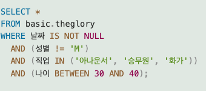
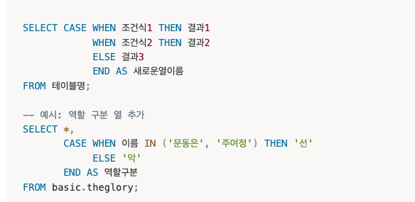
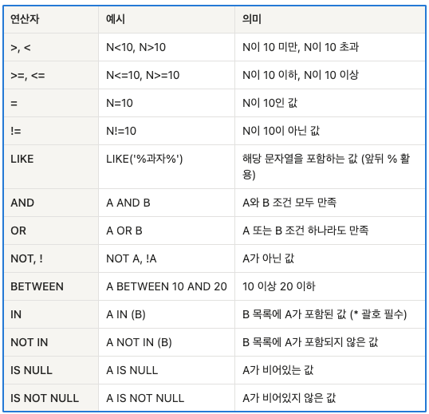
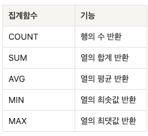
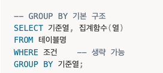

## 데이터 조회

- 실무에서는 SELECT * 보다 필요한 컬럼만 명시하는 편

[case when]

[조건문 연산자]

[like와 in 차이]
- like: 앞뒤 % 붙여서 전후 포함관계 기준으로 집계 가능
- in ('문자열'): '문자열' 정확히 들어간 경우만 집계

[order by]
- 특정 열 기준 정렬, 기본값 오름차순
- 구문중 가장 마지막에 실행됨
- 여러 열 지정 가능 (순서대로 실행)
  
---
## 데이터 집계와 분석

[집계함수]

- round() 붙여서 소숫점 끊기 적용 가능
- count(*): NULL값 포함한 모든 행 개수 셈
- count(특정 열): NULL값 제외한 행 개수만 셈
  

[group by 주의사항]

- SELECT에 집계함수 들어갈 때는 GROUP BY에 기준열 그룹화 꼭 해야함
- -> 집계함수는 행을 압축, 기준열은 행을 있는 그대로 반환하기 때문에 기준열도 GROUP BY로 압축해야 함
- SELECT에 집계함수 아닌 열이 있으면 그 열은 반드시 GROUP BY에 들어가야 함
- 
