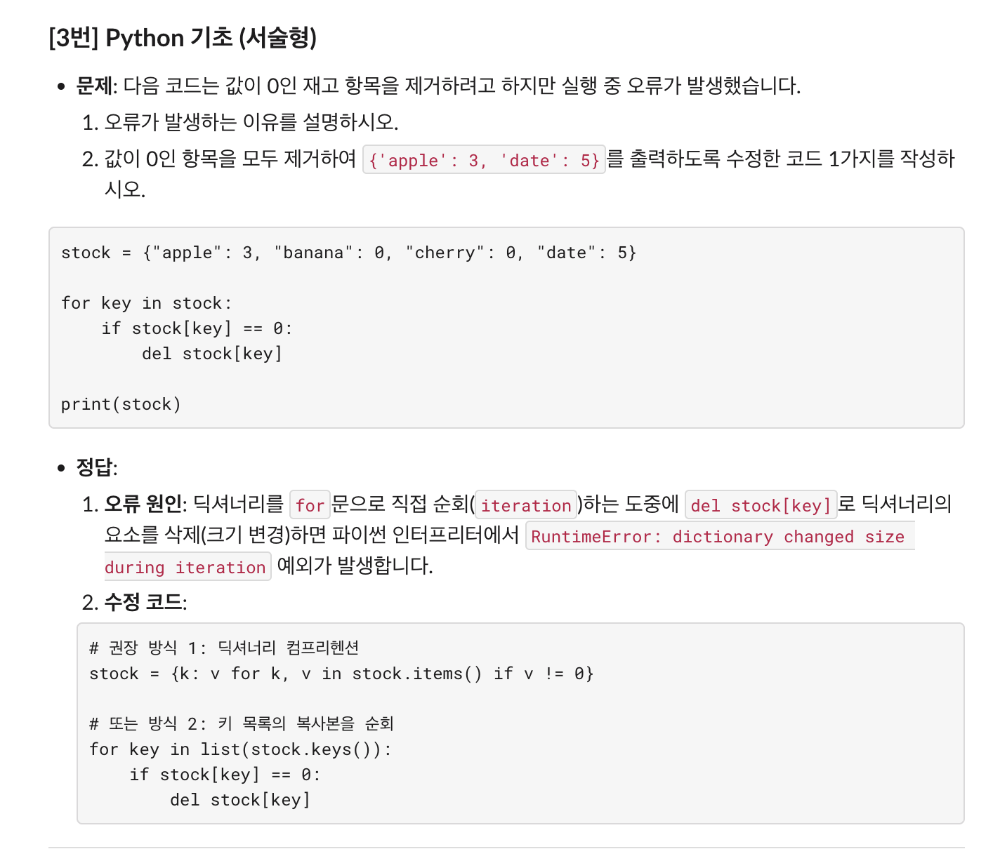
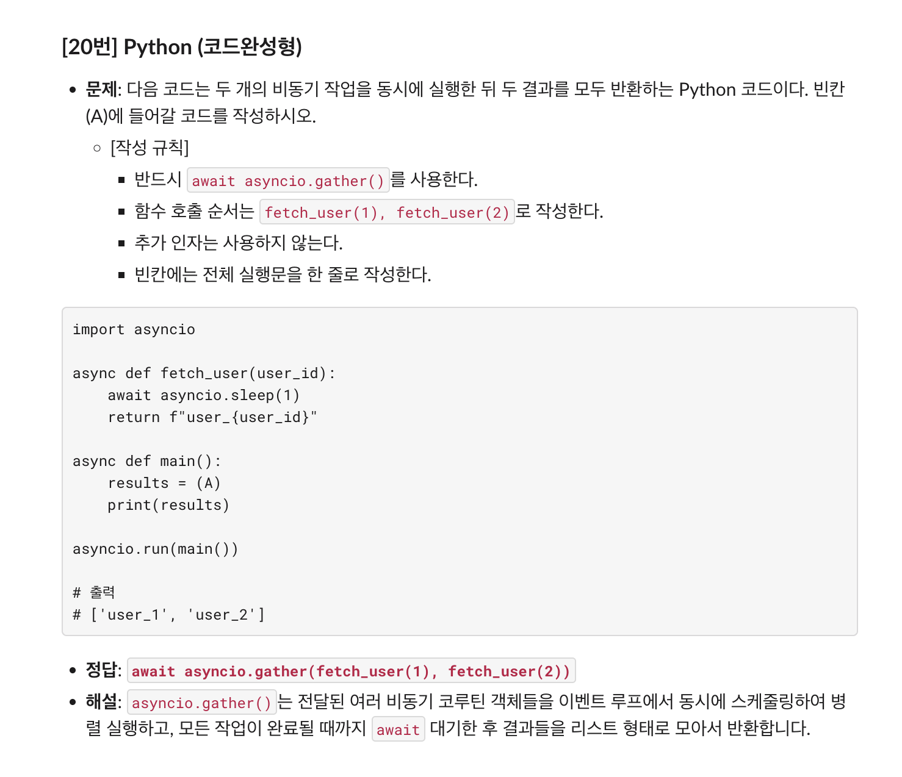

260911 TIL
---

API
- REST API
- Supabase REST API
---
Python type hint

---
stored program

---
빌더 패턴/생성 패턴

---
동적 변수

---
[IS NULL vs. = null]
- Never use `= null`: it will give you nothing
- `IS NULL`: return the row where the null is
  
---

---

---

---
github blog study session
